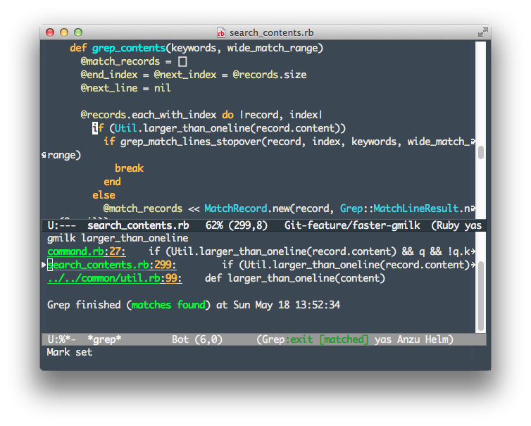

emacs-milkode
=================

Overview
------------

Support [Milkode](https://github.com/ongaeshi/milkode) search for Emacs.

**milkode.el** use `M-x grep`.

If you want to search with anything, Use [anything-milkode](https://github.com/ongaeshi/anything-milkode).

Screenshot
------------



Install
------------

### milkode

You can install emacs-milkode.el from MELPA with package.el

```
M-x package-install milkode
```

If you use `auto-install`.

```emacs-lisp:install.el
(auto-install-from-url "https://raw.github.com/ongaeshi/emacs-milkode/master/milkode.el")
```

Setting.

```emacs-lisp:~/.emacs.d/init.el
(require 'milkode)
;; Shortcut setting (Your favorite things)
(global-set-key (kbd "M-g") 'milkode:search)
(global-set-key (kbd "M-s") 'milkode:search-at-point)
```

Feature
------------

### milkode

Command                              | Description
------------------------------------ | -------------------------------------
M-x milkode:search                   | Milkode search using `M-x grep`
M-x milkode:search-from-all-packages | Milkode search all registered packages using `M-x grep`
M-x milkode:search-at-point          | Milkode search current package at point text
With C-u                             | Search all registered packages
M-x milkode:display-history          | Dispaly search history
M-x milkode:add                      | Execute `milk add`
M-x milkode:update                   | Execute `milk update`

### Direct jump

1. When you search for direct pass `/path/to/dir:15` jump directly to the specified row.
1. Move the cursor to direct pass on a text file, `milkode:search` can jump

Displayed direct pass to click the line number in the 'milk web' (ex. http://kodeworld.ongaeshi.me/)

License
------------

MIT 

----
Copyright (c) 2013 ongaeshi <<ongaeshi0621@gmail.com>>

